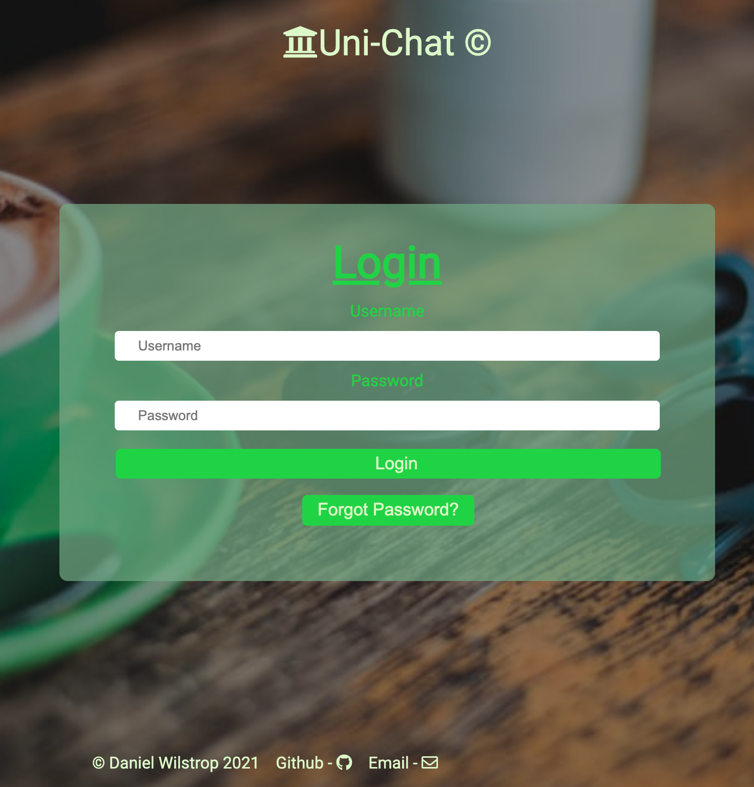
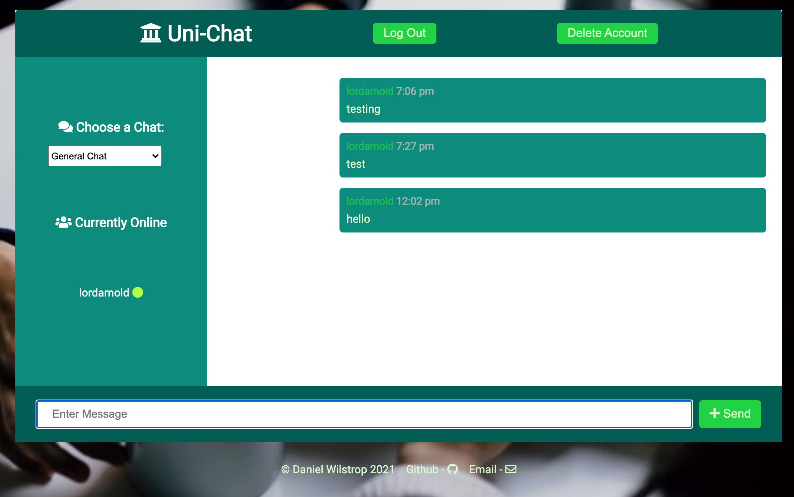
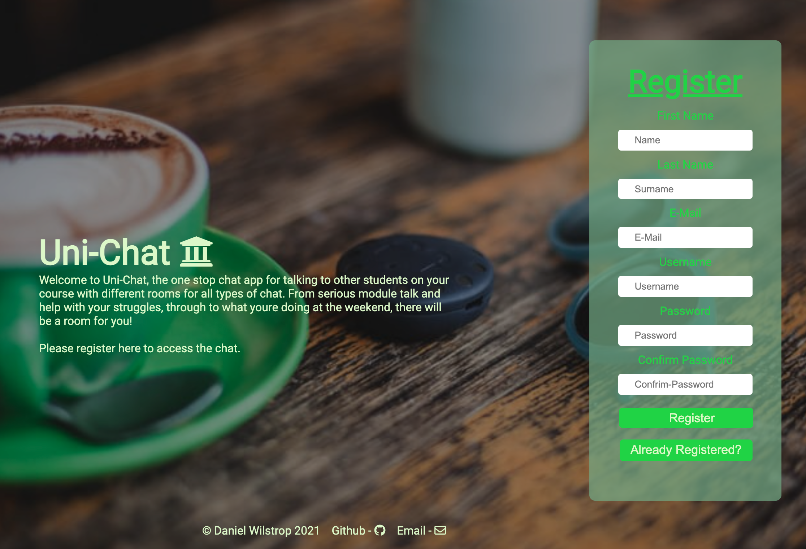

## Live Chat Web APP - with Auth and Database ##

Full live chat app with seperate rooms, user authentication using JWT and mongoDB 

All messages stored on mongoDB and brought back when app loads.

My first "full stack" app

Tech used : 
    - Vanilla Javascript/HTML/CSS
    - MongoDB/Mongoose
    - WebSockets
    - JSON Web Tokens
    - Node.js/Express
    - GIT for version control
    - Heroku for deployment

[Live Site - Here](https://webchat-unichat.herokuapp.com/)

    

    

    